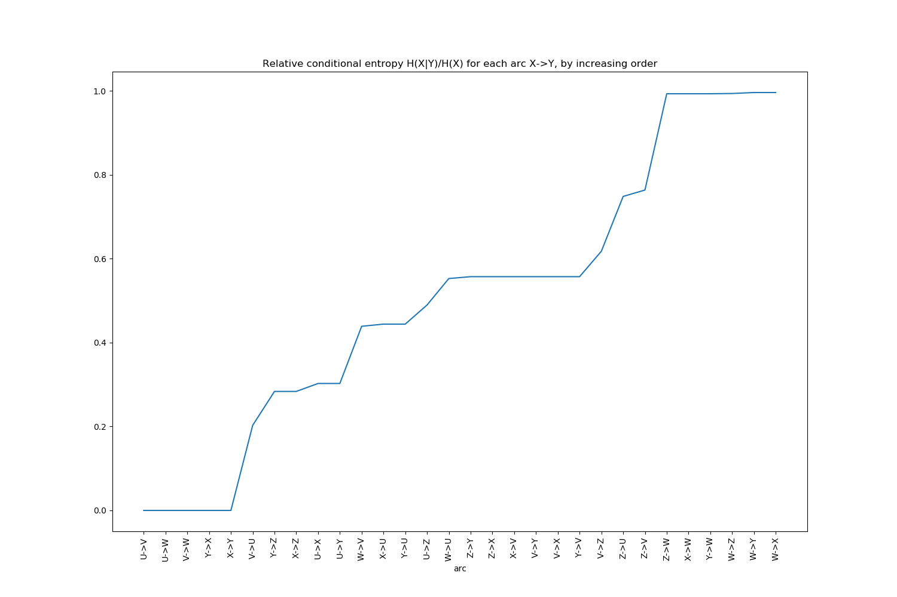

# qdscreen

*Remove redundancy in your categorical variables and increase your models performance.*

[](https://pypi.python.org/pypi/qdscreen/) [](https://github.com/python-qds/qdscreen/actions/workflows/base.yml) [](./reports/junit/report.html) [](https://codecov.io/gh/python-qds/qdscreen)

[](https://python-qds.github.io/qdscreen/) [](https://pypi.python.org/pypi/qdscreen/) [](https://pepy.tech/project/qdscreen) [](https://pepy.tech/project/qdscreen) [](https://github.com/python-qds/qdscreen/stargazers)

`qdscreen` provides a python implementation of the Quasi-determinism screening algorithm (also known as `qds-BNSL`) from T.Rahier's PhD thesis, 2018.

Most data scientists are familiar with the concept of *correlation* between continuous variables. This concept extends to categorical variables, and is known as *functional dependency* in the field of relational databases mining. We also name it *determinism* in the context of Machine Learning and Statistics, to indicate that when a random variable `X` is known then the value of another variable `Y` is determined with absolute certainty. *"Quasi-"*determinism is an extension of this concept to handle noise or extremely rare cases in data.

`qdscreen` is able to detect and remove (quasi-)deterministic relationships in a dataset:

 - either as a preprocessing step in any general-purpose data science pipeline
   
 - or as an accelerator of a Bayesian Network Structure Learning method such as [`pyGOBN`](https://github.com/ncullen93/pyGOBN)


## Installing

```bash
> pip install qdscreen
```

## Usage

### 1. Remove correlated variables

#### a. Strict determinism

Let's consider the following dataset:

```python
import pandas as pd

df = pd.DataFrame({
   'U': ["a", "b", "d", "a", "b", "c", "a", "b", "d", "c"],
   'V': ["a", "b", "c", "a", "b", "c", "a", "b", "c", "c"],
   'W': ["a", "b", "b", "a", "b", "b", "a", "b", "b", "b"],
   'X': ["a", "a", "b", "b", "a", "c", "c", "a", "b", "c"],
   'Y': ["b", "b", "c", "c", "b", "a", "a", "b", "c", "a"],
   'Z': ["a", "a", "b", "a", "a", "b", "b", "a", "a", "b"]  
})
```

We can detect correlated categorical variables (functional dependencies):

```python
from qdscreen import qd_screen

# detect strict deterministic relationships
qd_forest = qd_screen(df)
print(qd_forest)
```

yields

```
QDForest (6 vars):
 - 3 roots (1+2*): U*, X*, Z
 - 3 other nodes: V, W, Y

U
└─ V
   └─ W

X
└─ Y
```

So with only features `U`, and `X` we should be able to predict `V`, `W`, and `Y`. `Z` is a root but has no children so it does not help. We can create a feature selection model from this deterministic forest object:

```python
print("Columns in df: %s" % list(df.columns))

# fit a feature selection model
feat_selector = qd_forest.fit_selector_model(df)

# use it to filter...
only_important_features = feat_selector.remove_qd(df)
print("Columns in only_important_features: %s" % list(only_important_features.columns))

# or to restore/predict
restored_full_df = feat_selector.predict_qd(only_important_features)
print("Columns in restored_full_df: %s" % list(restored_full_df.columns))

# note that the order of columns differs from origin
pd.testing.assert_frame_equal(df, restored_full_df[df.columns])
```

yields

```
Columns in df: ['U', 'V', 'W', 'X', 'Y', 'Z']
Columns in only_important_features: ['U', 'X', 'Z']
Columns in restored_full_df: ['U', 'X', 'Z', 'V', 'W', 'Y']
```

#### b. Quasi determinism

In the above example, we used the default settings for `qd_screen`. By default only deterministic relationships are detected, which means that only variables that can perfectly be predicted (without loss of information) from others in the dataset are removed.

In real-world datasets, some noise can occur in the data, or some very rare cases might happen, that you may wish to discard. Let's first look at the strength of the various relationships thanks to `keep_stats=True`:

```python
# the same than above, but this time remember the various indicators
qd_forest = qd_screen(df, keep_stats=True)

# display them
print(qd_forest.stats)
```

yields:

```
Statistics computed for dataset:
   U  V  W  X  Y  Z
0  a  a  a  a  b  a
1  b  b  b  a  b  a
...(10 rows)

Entropies (H):
U    1.970951
V    1.570951
W    0.881291
X    1.570951
Y    1.570951
Z    0.970951
dtype: float64

Conditional entropies (Hcond = H(row|col)):
          U         V         W         X         Y         Z
U  0.000000  0.400000  1.089660  0.875489  0.875489  1.475489
V  0.000000  0.000000  0.689660  0.875489  0.875489  1.200000
W  0.000000  0.000000  0.000000  0.875489  0.875489  0.875489
X  0.475489  0.875489  1.565148  0.000000  0.000000  0.875489
Y  0.475489  0.875489  1.565148  0.000000  0.000000  0.875489
Z  0.475489  0.600000  0.965148  0.275489  0.275489  0.000000

Relative conditional entropies (Hcond_rel = H(row|col)/H(row)):
          U         V         W         X         Y         Z
U  0.000000  0.202948  0.552860  0.444196  0.444196  0.748618
V  0.000000  0.000000  0.439008  0.557299  0.557299  0.763869
W  0.000000  0.000000  0.000000  0.993416  0.993416  0.993416
X  0.302676  0.557299  0.996307  0.000000  0.000000  0.557299
Y  0.302676  0.557299  0.996307  0.000000  0.000000  0.557299
Z  0.489715  0.617951  0.994024  0.283731  0.283731  0.000000

```

In the last row of the last table (relative conditional entropies) we see that variable `Z`'s entropies decreases drastically to reach 28% of its initial entropy, if `X` or `Y` is known. So if we use quasi-determinism with relative threshold of 29% `Z` would be eliminated. 

```python
# detect quasi deterministic relationships
qd_forest2 = qd_screen(df, relative_eps=0.29)
print(qd_forest2)
```

Yields:

```
QDForest (6 vars):
 - 2 roots (0+2*): U*, X*
 - 4 other nodes: V, W, Y, Z

U
└─ V
   └─ W

X
└─ Y
└─ Z

```

This time `Z` is correctly determined as being predictible from `X`. 

!!! note "equivalent nodes"
    `X` and `Y` are equivalent variables so each of them could be the parent of the other. To avoid cycles so that the result is still a forest (a set of trees), `X` was arbitrary selected as being the "representative" parent of all its equivalents, and `Z` is attached to this representative parent.

Another, easier way to detect that setting a relative threshold to 29% would eliminate `Z` is to print the conditional entropies in increasing order:

```python
ce_df = qd_forest.get_entropies_table(from_to=False, sort_by="rel_cond_entropy") 
print(ce_df.head(10))
```

which yields

```
      cond_entropy  rel_cond_entropy
arc                                 
U->V      0.000000          0.000000
U->W      0.000000          0.000000
V->W      0.000000          0.000000
Y->X      0.000000          0.000000
X->Y      0.000000          0.000000
V->U      0.400000          0.202948
Y->Z      0.275489          0.283731
X->Z      0.275489          0.283731
U->X      0.475489          0.302676
U->Y      0.475489          0.302676
```

Or to use the helper plot function:

```python
qd_forest.plot_increasing_entropies()
```



#### c. Integrating with scikit-learn

`scikit-learn` is one of the most popular machine learning frameworks in python. It comes with a concept of `Pipeline` allowing you to chain several operators to make a model. `qdscreen` provides a `QDSSelector` class for easy integration. It works exactly like other feature selection models in scikit-learn (e.g. [`VarianceThreshold`](https://scikit-learn.org/stable/modules/feature_selection.html#variance-threshold)):

```python
>>> X = [[0, 2, 0, 3],
...      [0, 1, 4, 3],
...      [0, 1, 1, 3]]

>>> selector = QDSSelector()
>>> Xsel = selector.fit_transform(X)
>>> Xsel
array([[0],
       [4],
       [1]])
>>> selector.inverse_transform(Xsel)
array([[0, 2, 0, 3],
...    [0, 1, 4, 3],
...    [0, 1, 1, 3]])
```


### 2. Learn a Bayesian Network structure

TODO see [#6](https://github.com/python-qds/qdscreen/issues/6).


## Main features / benefits

 * A feature selection algorithm able to eliminate quasi-deterministic relationships
   
    - a base version compliant with numpy and pandas datasets
    - a scikit-learn compliant version (numpy only)

 * An accelerator for Bayesian Network Structure Learning tasks


## See Also

 - Bayesian Network libraries in python: 
   
    - [`pyGOBN`](https://github.com/ncullen93/pyGOBN) (MIT license)
    - [`pgmpy`](https://github.com/pgmpy/pgmpy) (MIT license)
    - [`pomegranate`](https://pomegranate.readthedocs.io/en/latest/index.html) (MIT license)
    - [`bayespy`](http://bayespy.org/) (MIT license)

 - Functional dependencies libraries in python:

    - [`fd_miner`](https://github.com/anonexp/fd_miner), an algorithm that was used in [this paper](https://hal.archives-ouvertes.fr/hal-01856516/document). The repository contains a list of reference datasets too.
    - [`FDTool`](https://github.com/USEPA/FDTool) a python 2 algorithm to mine for functional dependencies, equivalences and candidate keys. From [this paper](https://f1000research.com/articles/7-1667).
    - [`functional-dependencies`](https://github.com/amrith/functional-dependencies)
    - [`functional-dependency-finder`](https://github.com/gustavclausen/functional-dependency-finder) connects to a MySQL db and finds functional dependencies.

 - Other libs for probabilistic inference:

    - [`pyjags`](https://github.com/michaelnowotny/pyjags) (GPLv2 license)
    - [`edward`](http://edwardlib.org/) (Apache License, Version 2.0)

 - Stackoverflow discussions:

    - [detecting normal forms](https://stackoverflow.com/questions/2157531/python-code-for-determining-which-normal-form-tabular-data-is-in)
    - [canonical cover](https://stackoverflow.com/questions/2822809/program-to-find-canonical-cover-or-minimum-number-of-functional-dependencies)


### Others

*Do you like this library ? You might also like [smarie's other python libraries](https://github.com/smarie/OVERVIEW#python)* 

## Want to contribute ?

Details on the github page: [https://github.com/python-qds/qdscreen](https://github.com/python-qds/qdscreen)
